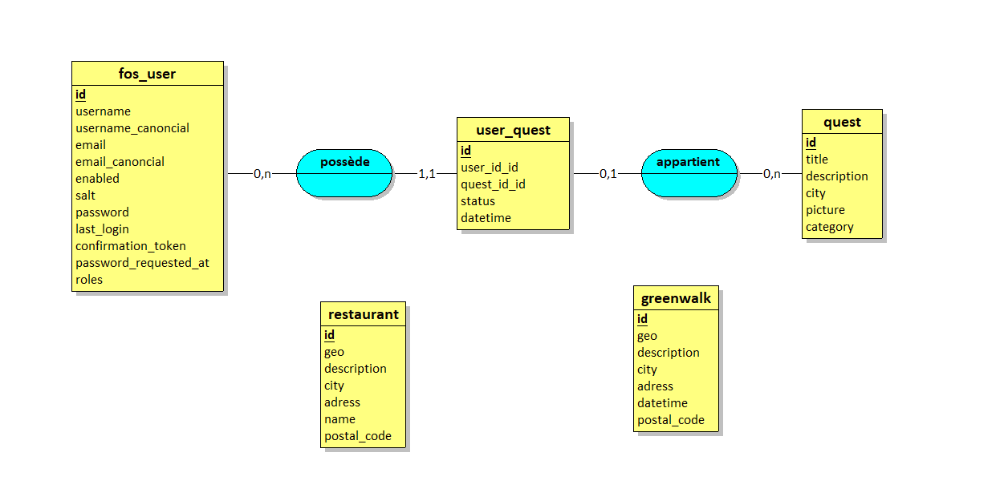

# api-fil-rouge

##Contributeur

- Louis Zawadka

## Requirements

- Mysql
- Composer

## Start project

```
 composer install
```

- Set DATABASE_URL in .env(db_name is greenleaf)

```
./bin/console doctrine:database:create
./bin/console make:migration
./bin/console doctrine:migrations:migrate
./bin/console doctrine:fixtures:load

./bin/console server:run
```
- Si une erreur avec HttpClient

```
composer require symfony/http-client
```


#### To check if your app is working go to

> yourlocalhost/api

If you can see api platform's swagger, everything is okay for you :)

## Modélisation de la base de données :

### Diagramme



Nous avions plusieurs type de données : API externe et données en dur.

Dans le cas des données en dur, ce qui à été fait est que chaque set de données à sa propre table, afin de pouvoir y accéder via la route de l’API configurer. 

Ensuite nous avons les données des API externe, ce qui à été fait est qu’un controller à été créé et qu’une route est configurer par set de données. 

Donc chaque table de données sont indépendantes les une des autres, et il n’y a que la table de quest et de fos_user qui sont lié. Il y a une table qui vient faire la jointure (user_quest) afin de stocker des informations d’utilisateur et des ces quêtes dans une table.

### Relation

Pour une relation ManyToOne prenons l’exemple où l’on à un utilisateur qui POST une user_quest. Dans notre cas un utilisateur peut avoir plusieurs user_quest, mais un user_quest ne peut pas avoir plusieurs utilisateur. 
Ce qui est le même cas pour un user_quest et une quest, une quêtes peut avoir plusieurs user_quest mais un user_quest ne peut avoir que une seul quête.


## Symfony & API :

### API

La route API Plateform du user à été réactiver car en front ils ne sont par parvenu à passer par la route /login et /register (envoie d’un form data) qui à été configurer et toujours accessible, pour gérer un utilisateur de façon sécurisé. Donc nous passons par la route /api/user afin de PUT, GET et DELETE un utilisateur.(bundle : FOSUserBundle)

La route api/user_quest permet de GET toute les quêtes d’un même utilisateur avec leur status. Le POST permet d’ajouter une quête au suivis de quête utilisateur et le PUT est la pour finaliser une quête en mofifiant son status.

Les routes api/restaurant, api/greenwalk et api/quest ne sont disponible que en GET car elle sont la uniquement pour nous permettre d’accéder à un set de données.

Ensuite nous avons trois routes disponible sur le conroller dataApiRequest qui sont            /trash, /velib et /trottinette sont à part car ce sont des API externe et j’ai créer leur propres routes, il n’y a que un get sur ces route car cela nous remonte uniquement un set de données.

### Documentation 

- Pour accéder au swagger d’API Plateform : /api
- Pour accéder aux données des restaurant : /restaurant
- Pour accéder aux données des greenwalk : /restaurant
- Pour accéder au login et register de l’utilisateur via le bundle(FOSUserBundle) : /login et /register


